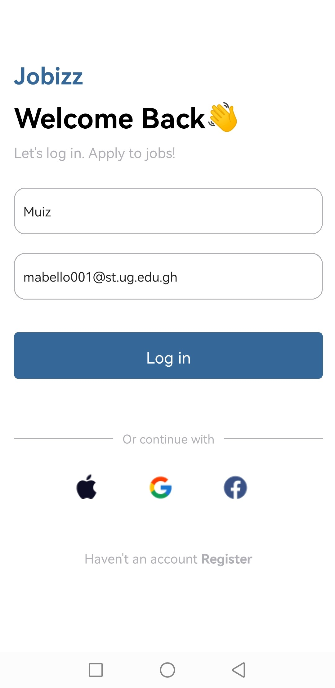

# rn-assignment4-11068463

## Functionality Description

1. **The Log in Page**: This was achieved using the _TextInput_ tags. The required placeholder was included as well.

2. **The log in button**: This was achieved using a touchable opacity and onPress logic to route the values of the fields to the homepage.

3. **Featured Jobs**: This was achieved using a _View_ component and a _ScrollView_ to allow horizontal scrolling.The contents of the card are mapped to the component as props allowing changing of colours, positions etc.

4. **Popular jobs**: This was achieved using a _View_ component and a _ScrollView_ to allow scrolling. The contents of the card are mapped to the component as props allowing changing of salaries, positions etc.

## Project Images

